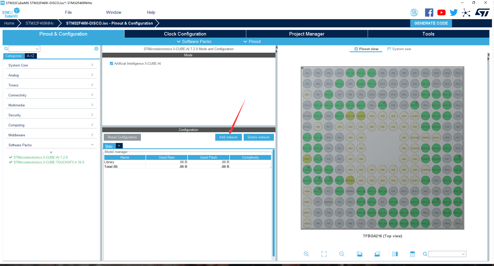
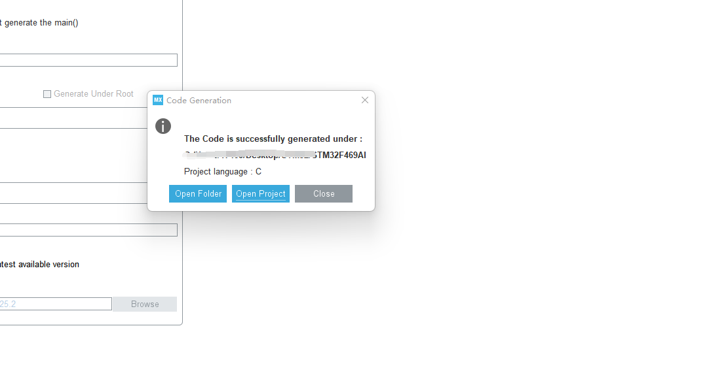

# STM32F469——AI运行实例（手写字识别）多图

<iframe src="//player.bilibili.com/player.html?aid=305092977&bvid=BV11P411c7Rj&cid=891434734&page=1" scrolling="no" border="0" frameborder="no" framespacing="0" allowfullscreen="true"> </iframe>

本次开发的流程是TouchGFX designer ----->  STM32CubeMX -----> Keil5

之所以采用此流程主要是因为，我们之前有采用STM32CUBEMX创建项目让然后再更改项目，或者直接写代码，但是会遇到各种BUG。我是非硬件科班出身的，是学软件的。对硬件方面的知识了解的不多，所以开发起来会比较费时。最后通过各种尝试才试通了此流程。

整个项目的代码放在我的GitHub上：

## 1. 开发板简介

STM32F469系列MCU提供ARM® Cortex®-M4卓越性能并集成大容量存储器和丰富的外设以实现先进的消费类、工业和医疗应用。适用于Flash存储器的ART Accelerator™和适用于结合LCD-TFT和MIPI-DSI显示接口进行图形处理的Chrom-ART Accelerator™，能够为高要求的实时处理提供足够资源和高级用户界面。
STM32F469系列单片机提供了512KB~2MB Flash、384KB SRAM和168~216个引脚。最小封装尺寸至4.89 x 5.69 mm。

- **性能**：在180 MHz频率下，从Flash执行时，STM32F446单片机能够提供225 DMIPS/608 CoreMark性能，并且利用意法半导体的ART Accelerator™实现了零等待状态。DSP指令和浮点运算单元扩大了产品的应用范围。

- **图形用户界面**：

  **•** STM32F469和STM32F479 MCU集成意法半导体的专利Chrom-ART Accelerator™，在非常低的CPU负载条件下即可实现先进的图形处理功能，并能够提供先进的用户界面和更丰富的体验。

  **•** 除了集成有TFT-LCD控制器，还集成了新型显示接口（MIPI串行显示接口）。该串行接口通过少量引脚即可连接显示器，并能够提高支持的显示分辨率。

- **集成**：得益于灵活的存储控制器（FMC）和双模式Quad SPI接口，轻松扩展存储范围。在90 MHz下工作的FMC带有一个32位的并行接口，能支持Compact Flash、SRAM、PSRAM、NOR、 NAND以及SDRAM存储器。双模式Quad SPI工作频率为90 MHz，实现了高性价比的NOR Flash，并支持内存映射模式。

**音频**：2个专用音频PLL，2路全双工I²S和1路串行音频接口（SAI），支持全双工I²S和时分复用（TDM）模式。  

- **通信**：

  **•** 以太网MAC和USB OTG FS及HS，带有专用电源轨使片上USB PHY能够在整个MCU供电电压范围内工作。

  **•** 扩展通信接口（包括4个USART、4个速度达11.25 Mbit/s的UART、6个速度达45 Mbit/s的SPI、3个具有新型可选数字滤波器功能的I²C、2个CAN、SDIO以及摄像头接口）。

- **模拟**：两个12位DAC和三个速度为2.4 MSPS或7.2 MSPS（交错模式）的12位ADC。

- **定时器**：多达17个频率高达180 MHz的16和32位定时器。

- **加密**：STM32F479还集成了支持AES-128、-192和-256以及三重DES、散列函数（MD5、SHA-1、SHA-2）、HMAC、真随机数发生器（TRNG）的硬件加密加速器。

- **功效**：该系列产品采用意法半导体90 nm工艺和ART Accelerator™，具有动态功耗调节功能，能够在运行模式下和从Flash存储器执行时实现低至280 µA/MHz的电流消耗（@ 180 MHz）停机模式下，功耗为120 µA（典型值）


## 2.开发环境

本次开发的软件以及对应的版本：keil5、stm32cubeMX 5.3.0、TouchGFX designer 4.16.0

固件包的版本以及cube包：STM32Cube FW_F4 V1.25.2、X-CUBE-AI 7.2.0、X-CUBE-TOUCHGFX 4.16.0

### 2.1软件安装（已安装可忽略）

#### keil5安装

可以参考其他博客，如：https://blog.csdn.net/Matcha_ice_cream/article/details/118684582

#### stm32cubeMX安装

如：https://blog.csdn.net/Brendon_Tan/article/details/107685563

#### TouchGFX designer 4.16.0安装

在安装stm32cubemx之后，我们可以打开它，然后现在它上面安装touchGFX designer的软件包，然后在他对应的版本上安装对应版本的软件。


在安装好之后，首先我们要先到STM32CUBEMX软件的驱动包找到刚才安装的软件包：


双击安装即可

## 3.实现流程

### 3.1 打开TouchGFX designer软件创建基于STM32F469开发板的项目

打开软件之后，点击CHANGE，在进入的界面查询框输入STM32F469，我们就可以找到我们的开发板，之后选择它点击SELECT。（项目的位置和名称可以自己选择更改）


创建完项目之后，我们将进入以下所示的界面，我们点击生成代码。


之后我们去项目的根目录，我们可以发现STM32CubeMX的.ioc文件


### 3.2 通过STM32CubeMX软件打开刚才创建的项目，并安装AI依赖包，添加AI网络，进行相关设置

打开之后我们选择迁移固件库为最新版本，然后我们需要装以下我们的软件包，也就是运行AI和TouchGFX所需要的包，分别为X-CUBE-AI 7.2.0、X-CUBE-TOUCHGFX4.16.0


在安装好依赖包之后，我们将它选择上去。


点击AI管理包，然后在里面选择添加网络




上一步主要选择好网络之后我们需要进行分析，也就是看我们的开发板能不能支持我们的网络正常运行，是否有足够的内存等。如果可以则如上图所示，否则可能需要使用更大的压缩比。


之后我们需要生成keil5项目代码


在生成之后我们将见到如下界面



此时TouchGFX Designer软件将会进行提醒，选择YES


点击生成代码：


### 3.3 使用Keil5打开项目，更改项目相关配置

我们直接点击open Project，然后如下所示


一般来说，创建完之后我们的项目时正常的，但是可能是由于有两个软件包的原因，或者什么其他原因，生成的项目中，AI文件的路径上会有些问题，项目会无法找到他们。我们需要进行一定的修改。


修改如下，我们首先将他们三个文件移除，


然后右击此分组，


找到此项目根目录中的X-CUBE-AI/APP路径也就是：你的项目路径/X-CUBE-AI/APP，在本项目中为：STM32F469AI/X-CUBE-AI/APP

然后将以下三个文件添加进去：


之后以同样的操作进行另外一个文件的添加，此文件的路径为：你的项目路径/Middlewares/ST/AI/Lib


添加成功后


之后我们该需要更改一下我们项目的路径配置


我们需要更改的为以下两个：


更改为：


点击编译项目


如果如下图所示，则说明编译成功


### 3.4 进行手写字识别的相关文件与相关库的引入

首先我们要先到STM32CUBEMX软件的驱动包里面找到一个文件如下，此软件的驱动包可以在软件的这个位置找到


之后找到这个路径，同时找到如下的文件：


复制它到项目的相对于的驱动文件路径，如下图：


然后我们在下面的分组中加入它


然后打开它，找到以下部分进行修改，将函数注释，否则之后会出现多次定义的错误：


另外一个时字体相关的配置，我们将Utilities文件夹以及其中的fonts文件夹和文件复制到到此项目中。


### 3.5 进行手写字识别的代码编写，进行代码烧录

1. 打开network.h文件，可以通过先打开network.c，然后右键点击引入network.h，然后跳转过去，


在里面加入如下代码：


2.首先在项目根路径/X-CUBE-AI/App里面创建两个文件，分别为：app_x-cube-ai.c和app_x-cube-ai.h


之后在在Application/User/X-CUBE-AI/App组中添加这两个文件如下所示：


app_x-cube-ai.h文件中加入：

```c
/* Define to prevent recursive inclusion -------------------------------------*/
#ifndef __APP_AI_H
#define __APP_AI_H
#ifdef __cplusplus
 extern "C" {
#endif
/**
  ******************************************************************************
  * @file           : app_x-cube-ai.h
  * @brief          : AI entry function definitions
  ******************************************************************************
  * This notice applies to any and all portions of this file
  * that are not between comment pairs USER CODE BEGIN and
  * USER CODE END. Other portions of this file, whether
  * inserted by the user or by software development tools
  * are owned by their respective copyright owners.
  *
  * Copyright (c) 2018 STMicroelectronics International N.V.
  * All rights reserved.
  *
  * Redistribution and use in source and binary forms, with or without
  * modification, are permitted, provided that the following conditions are met:
  *
  * 1. Redistribution of source code must retain the above copyright notice,
  *    this list of conditions and the following disclaimer.
  * 2. Redistributions in binary form must reproduce the above copyright notice,
  *    this list of conditions and the following disclaimer in the documentation
  *    and/or other materials provided with the distribution.
  * 3. Neither the name of STMicroelectronics nor the names of other
  *    contributors to this software may be used to endorse or promote products
  *    derived from this software without specific written permission.
  * 4. This software, including modifications and/or derivative works of this
  *    software, must execute solely and exclusively on microcontroller or
  *    microprocessor devices manufactured by or for STMicroelectronics.
  * 5. Redistribution and use of this software other than as permitted under
  *    this license is void and will automatically terminate your rights under
  *    this license.
  *
  * THIS SOFTWARE IS PROVIDED BY STMICROELECTRONICS AND CONTRIBUTORS "AS IS"
  * AND ANY EXPRESS, IMPLIED OR STATUTORY WARRANTIES, INCLUDING, BUT NOT
  * LIMITED TO, THE IMPLIED WARRANTIES OF MERCHANTABILITY, FITNESS FOR A
  * PARTICULAR PURPOSE AND NON-INFRINGEMENT OF THIRD PARTY INTELLECTUAL PROPERTY
  * RIGHTS ARE DISCLAIMED TO THE FULLEST EXTENT PERMITTED BY LAW. IN NO EVENT
  * SHALL STMICROELECTRONICS OR CONTRIBUTORS BE LIABLE FOR ANY DIRECT, INDIRECT,
  * INCIDENTAL, SPECIAL, EXEMPLARY, OR CONSEQUENTIAL DAMAGES (INCLUDING, BUT NOT
  * LIMITED TO, PROCUREMENT OF SUBSTITUTE GOODS OR SERVICES; LOSS OF USE, DATA,
  * OR PROFITS; OR BUSINESS INTERRUPTION) HOWEVER CAUSED AND ON ANY THEORY OF
  * LIABILITY, WHETHER IN CONTRACT, STRICT LIABILITY, OR TORT (INCLUDING
  * NEGLIGENCE OR OTHERWISE) ARISING IN ANY WAY OUT OF THE USE OF THIS SOFTWARE,
  * EVEN IF ADVISED OF THE POSSIBILITY OF SUCH DAMAGE.
  *
  ******************************************************************************
  */
/* Includes ------------------------------------------------------------------*/
#include "ai_platform.h"
#include "stm32469i_discovery_lcd.h"
#include<stdio.h>
#include<stdlib.h>
#include<string.h>
void MX_X_CUBE_AI_Init(void);
void MX_X_CUBE_AI_Process(const ai_float *in_data, ai_float *out_data,const ai_u16 batch_size);

/* Multiple network support --------------------------------------------------*/


typedef struct {
    const char *name;
    ai_network_params params;
    ai_buffer *config;
    ai_handle (*ai_data_weights_get_default)(void);
    ai_bool (*ai_get_info)(ai_handle network, ai_network_report* report);
    ai_error (*ai_create)(ai_handle* network, const ai_buffer* network_config);
    ai_error (*ai_get_error)(ai_handle network);
    ai_handle (*ai_destroy)(ai_handle network);
    ai_bool (*ai_init)(ai_handle network, const ai_network_params* params);
    ai_i32 (*ai_run)(ai_handle network, const ai_buffer* input, ai_buffer* output);
    ai_i32 (*ai_forward)(ai_handle network, const ai_buffer* input);
} ai_network_entry_t;

#include "network.h"
#include "network_data.h"

#define AI_MNETWORK_NUMBER  (1)
#define AI_MNETWORK_DATA_ACTIVATIONS_SIZE AI_NETWORK_DATA_ACTIVATIONS_SIZE
#define AI_MNETWORK_IN_1_SIZE AI_NETWORK_IN_1_SIZE
#define AI_MNETWORK_OUT_1_SIZE AI_NETWORK_OUT_1_SIZE

AI_API_DECLARE_BEGIN

AI_API_ENTRY
const char* ai_mnetwork_find(const char *name, ai_int idx);

AI_API_ENTRY
ai_bool ai_mnetwork_get_info(
  ai_handle network, ai_network_report* report);

/*!
 * @brief Get first network error code.
 * @ingroup network
 * @details Get an error code related to the 1st error generated during
 * network processing. The error code is structure containing an
 * error type indicating the type of error with an associated error code
 * Note: after this call the error code is internally reset to AI_ERROR_NONE
 * @param network an opaque handle to the network context
 * @return an error type/code pair indicating both the error type and code
 * see @ref ai_error for struct definition
 */
AI_API_ENTRY
ai_error ai_mnetwork_get_error(ai_handle network);

/*!
 * @brief Create a neural network.
 * @ingroup network
 * @details Instantiate a network and returns an object to handle it;
 * @param network an opaque handle to the network context
 * @param network_config a pointer to the network configuration info coded as a
 * buffer
 * @return an error code reporting the status of the API on exit
 */
AI_API_ENTRY
ai_error ai_mnetwork_create(const char *name,
  ai_handle* network, const ai_buffer* network_config);

/*!
 * @brief Destroy a neural network and frees the allocated memory.
 * @ingroup network
 * @details Destroys the network and frees its memory. The network handle is returned;
 * if the handle is not NULL, the unloading has not been successful.
 * @param network an opaque handle to the network context
 * @return an object handle : AI_HANDLE_NULL if network was destroyed
 * correctly. The same input network handle if destroy failed.
 */
AI_API_ENTRY
ai_handle ai_mnetwork_destroy(ai_handle network);

/*!
 * @brief Initialize the data structures of the network.
 * @ingroup network
 * @details This API initialized the network after a successfull
 * @ref ai_network_create. Both the activations memory buffer
 * and params (i.e. weights) need to be provided by caller application
 *
 * @param network an opaque handle to the network context
 * @param params the parameters of the network (required).
 * see @ref ai_network_params struct for details
 * @return true if the network was correctly initialized, false otherwise
 * in case of error the error type could be queried by
 * using @ref ai_network_get_error
 */
AI_API_ENTRY
ai_bool ai_mnetwork_init(
  ai_handle network, const ai_network_params* params);

/*!
 * @brief Run the network and return the output
 * @ingroup network
 *
 * @details Runs the network on the inputs and returns the corresponding output.
 * The size of the input and output buffers is stored in this
 * header generated by the code generation tool. See AI_NETWORK_*
 * defines into file @ref network.h for all network sizes defines
 *
 * @param network an opaque handle to the network context
 * @param[in] input buffer with the input data
 * @param[out] output buffer with the output data
 * @return the number of input batches processed (default 1) or <= 0 if it fails
 * in case of error the error type could be queried by
 * using @ref ai_network_get_error
 */
AI_API_ENTRY
ai_i32 ai_mnetwork_run(
  ai_handle network, const ai_buffer* input, ai_buffer* output);

/*!
 * @brief Runs the network on the inputs.
 * @ingroup network
 *
 * @details Differently from @ref ai_network_run, no output is returned, e.g. for
 * temporal models with a fixed step size.
 *
 * @param network the network to be run
 * @param[in] input buffer with the input data
 * @return the number of input batches processed (usually 1) or <= 0 if it fails
 * in case of error the error type could be queried by
 * using @ref ai_network_get_error
 */
AI_API_ENTRY
ai_i32 ai_mnetwork_forward(
  ai_handle network, const ai_buffer* input);

AI_API_ENTRY
int ai_mnetwork_get_private_handle(ai_handle network,
        ai_handle *phandle,
        ai_network_params* pparams);

AI_API_DECLARE_END

#ifdef __cplusplus
}
#endif

#endif /*__STMicroelectronics_X-CUBE-AI_3_4_0_H */

```

app_x-cube-ai.c文件中加入：

```c
#include <string.h>
#include <stdio.h>
#include "app_x-cube-ai.h"
#include "ai_datatypes_defines.h"

static ai_handle network = AI_HANDLE_NULL;
static ai_buffer ai_input[AI_NETWORK_IN_NUM] = { AI_NETWORK_IN_1 };
static ai_buffer ai_output[AI_NETWORK_OUT_NUM] = { AI_NETWORK_OUT_1 };
AI_ALIGNED(4)
static ai_u8 activations[AI_NETWORK_DATA_ACTIVATIONS_SIZE];

void MX_X_CUBE_AI_Init(void)
{
    /* USER CODE BEGIN 0 */
    /* add these to the code */
		
    /* end of add these */

    ai_error err;
    err = ai_network_create(&network, AI_NETWORK_DATA_CONFIG);
		char errs[50];
    if(err.type != AI_ERROR_NONE) {
    	printf("E: AI error - type=%d code=%d\r\n", err.type, err.code);
			sprintf(errs ,"E: AI error - type=%d code=%d\r\n", err.type, err.code);
			BSP_LCD_DisplayStringAt(30,30,(uint8_t*) errs, LEFT_MODE);
    }


    ai_network_report report;
    ai_bool res;
    res = ai_network_get_info(network,&report);
    char input_report[16];
    char output_report[16];


    /* initialize network */
    const ai_network_params params = {
    AI_NETWORK_DATA_WEIGHTS(ai_network_data_weights_get()),
    AI_NETWORK_DATA_ACTIVATIONS(activations) };
    if (!ai_network_init(network, &params)) {
    err = ai_network_get_error(network);
    /* manage the error */
    if(err.type != AI_ERROR_NONE) {
    	printf("E: AI error - type=%d code=%d\r\n", err.type, err.code);
    }
    }
    /* USER CODE END 0 */
}


void MX_X_CUBE_AI_Process(const ai_float *in_data, ai_float *out_data,const ai_u16 batch_size)
{
		

    /* USER CODE BEGIN 1 */
    ai_input[0].size = 1;
    ai_input[0].data = AI_HANDLE_PTR(in_data);
    ai_output[0].size = 1;
    ai_output[0].data = AI_HANDLE_PTR(out_data);
    ai_error err;
    ai_int nbatch;
    nbatch = ai_network_run(network, &ai_input[0], &ai_output[0]);
	
    /* USER CODE END 1 */
}

```


3.之后打开main.c文件进行相关的代码编写


头文件


字体以及相关数据定义


界面以及预测重置等函数


main函数中相关设置


while循环中：


整个项目的代码都在github中可以得到。

4.进行编译，没有错误则正常，否则上述步骤中的代码或者相关配置出现了问题。


## 4.测试与展示

之后我们把主机与板子连接好


将代码烧录进去


等烧录成功之后就可以正常运行，当前使用的时用户按键作为识别按钮。


## 5.后续

识别模块算法更新